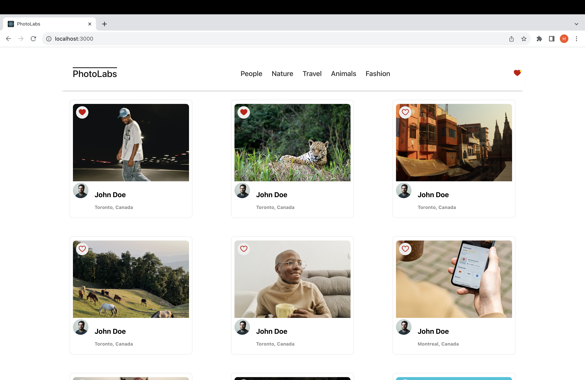

# react-photolabs
The PhotoLabs project for the Web Development React course programming.

# Photolabs
#Homepage


#Favorite Photos


#Larger View


## Setup

Install dependencies with `npm install` in each respective `/frontend` and `/backend`.

## [Frontend] Running Webpack Development Server

```sh
cd frontend
npm start
```

## [Backend] Running Backend Server

Read `backend/readme` for further setup details.

```sh
cd backend
npm start
```